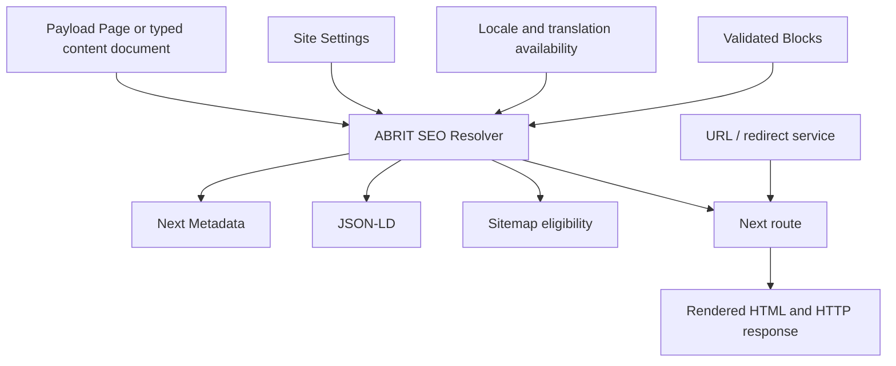

# Executive Decision

Rebuild SEO alongside the planned Payload Page/Block architecture instead of incrementally repairing every route-specific legacy metadata path. Make the URL/indexability contract, redirect system, localization contract, and test harness independent P0 foundations before or alongside the rebuild. Preserve the useful data and rendering primitives; replace the split frontend metadata pipeline with one resolver.

## Runtime Verification

The local development service and Docker PostgreSQL database were checked non-destructively on 2026-09-07.

| Check | Result | Evidence |
| --- | --- | --- |
| Generic canonical/head | PASSED | `GET /fa/about` rendered canonical `http://localhost:3000/fa/about`, robots, alternates, OG, Twitter, and Organization JSON-LD. |
| `robots.txt` | PASSED | `GET /robots.txt` returned `200 text/plain`, allows `/`, disallows `/api/` and `/admin/`, and names sitemap. |
| Sitemap | PASSED with known design limits | `GET /sitemap.xml` returned `200 application/xml`; it contains localized URLs but no lastmod/alternates and uses local host when the local site URL is unset. |
| Root redirect | PASSED | `GET /` with redirects disabled returned `307` and `Location: /fa`. |
| Missing-page status | PASSED | `GET /fa/this-seo-audit-does-not-exist` returned `404`. |
| CMS path in sitemap | PASSED | `GET /fa/testing` returned `200`; the prior audit inference that all non-allow-listed one-segment CMS records fail was incorrect. Nested paths remain unproven/unsupported by the route tree. |
| Anonymous preview | PARTIAL | `GET /fa/about?draft=1` returned `200` with normal published canonical/robots. All 93 locale rows are published, so no unpublished document or authenticated preview was safely available to prove authorization/draft rendering. |
| Scheduled publishing | RUNTIME VERIFICATION REQUIRED | `payload_jobs` and `payload_jobs_log` exist but both were empty; local Compose has only PostgreSQL, not a worker. `payload jobs:handle-schedules --help` connected safely but did not prove execution. |
| Publish to frontend revalidation | RUNTIME VERIFICATION REQUIRED | Proof requires a content mutation; none was performed. Static mismatch between invalidated tag and reads remains. |
| Duplicate current localized URLs | PASSED for current data | Read-only SQL found zero duplicate non-empty `content_locales.path` and `slug` values per locale. Schema shows non-unique indexes only, so the contract is still missing. |

Commands and output summaries are recorded in `SEO_AUDIT_CHECKLIST.md`.

## Current SEO Problem Classification

| Issue | Classification | Current Impact | Still Relevant After Rebuild? | Action |
| --- | --- | --- | --- | --- |
| Localized `path`/`slug` have no uniqueness contract | A - FOUNDATION ISSUE | Future duplicate URLs can be created despite zero current duplicates. | Yes | Define normalization and database/application uniqueness before URL cutover. |
| No redirect history or slug-change redirect | A - FOUNDATION ISSUE | Changed published URLs lose equity and links. | Yes | Add redirect lifecycle tied to URL changes. |
| Canonical/manual override is route-dependent | A - FOUNDATION ISSUE | Current output differs by route; editors cannot rely on canonical field. | Yes | Centralize canonical resolution and validation. |
| Robots/noindex is route-dependent and sitemap ignores it | A - FOUNDATION ISSUE | A noindex generic page can still be listed in sitemap. | Yes | Resolver owns indexability and sitemap eligibility. |
| Hreflang may advertise unavailable translations | A - FOUNDATION ISSUE | Dedicated routes emit all locales regardless of published translation. | Yes | Emit alternates from verified locale availability only. |
| SEO role cannot update SEO and has no field policy | A - FOUNDATION ISSUE | Intended specialist workflow is unavailable. | Yes | Define field/workflow permissions with SEO role. |
| No SEO output/redirect/sitemap test suite | A - FOUNDATION ISSUE | Regressions reach production unnoticed. | Yes | Add unit, integration, E2E, and CI gates. |
| `contentMetadata()` versus `routeMetadata()` | B - LEGACY FRONTEND ISSUE | Dedicated routes drop CMS canonical/robots/social controls. | No, if resolver is adopted | Replace, do not patch each route. |
| Static service/solution detail data | B - LEGACY FRONTEND ISSUE | Sitemap/CMS and rendered detail pages have different authorities. | No, after Page/Block migration | Migrate content to Payload; preserve URLs. |
| Hard-coded homepage metadata | B - LEGACY FRONTEND ISSUE | Home ignores stored SEO/site defaults. | No, after Page migration | Replace with resolver output. |
| Route-specific schema/unused ContentJsonLd | B - LEGACY FRONTEND ISSUE | Schema is incomplete and inconsistent. | No, after resolver/schema builders | Replace per-route emission. |
| Revalidation tag not attached to inspected reads | A - FOUNDATION ISSUE | Publish-to-render freshness is unproven. | Yes | Design tags/cache policy around resolver and verify by E2E. |
| SERP/social preview | C - FUTURE SEO SUITE FEATURE | Editor convenience only. | Yes, but not P0 correctness | Add after resolver/permissions. |
| Focus keywords, SEO score, analysis | C - FUTURE SEO SUITE FEATURE | No technical correctness impact. | Optional | Do not build initially. |
| GSC, monitoring, AI suggestions | C - FUTURE SEO SUITE FEATURE | No current technical SEO blocker. | Optional | Add only after monitoring and human-review workflows. |

## What Should Survive From The Current Implementation

- The Payload `content` document identity, localized title/excerpt/layout, `isActive`, drafts, localized publication status, versions, and scheduled-publish capability.
- The existing localized `seo` values as migration source data: title, description, canonical, index/follow, OG title/description/image.
- Required localized Media ALT and Payload image derivatives.
- `SiteSettings` brand/contact/logo data, Organization JSON-LD serialization, audit snapshots, and locale definitions (`fa`, `en`, `ar-ae`).
- The Local API server-side access pattern and published/active query policy, after consolidation behind a resolver.

## What Should Be Replaced During The UI/UX Rebuild

- Separate hard-coded/static service and solution content renderers and their route-specific `generateMetadata()` calls.
- The split `contentMetadata()`/`routeMetadata()` model and hard-coded homepage metadata.
- Route-specific sitemap eligibility inferred from arbitrary `content.path`.
- The unused `ContentJsonLd` path and ad hoc per-route schema rendering.
- The current revalidation tag implementation, after the target cache boundaries are defined.

## What Should Not Be Built Yet

- Yoast-style score, focus-keyword scoring, or mandatory readability analysis.
- AI-generated metadata, automated schema changes, or autonomous publishing.
- GSC dashboard, CTR automation, cannibalization analysis, and content-decay jobs.
- Sitemap splitting, unless the validated indexable URL count requires it.
- A monorepo SEO package before the first resolver and Page model prove reusable.

## Foundation Architecture

The future public renderer must receive one resolved Page representation per locale. Its SEO output, page HTML, JSON-LD, sitemap entry, preview state, and redirect lookup must agree on the same URL and indexability decision.



The resolver is application-owned code. Payload fields remain the source data; Next.js consumes an explicit resolved output rather than reinterpreting raw fields in every route.

## Payload Content/Page Model

Evolve the existing `content` collection first; do not create a parallel `pages` collection at this stage. It already has localized blocks, identity, SEO values, publication workflow, versions, and data in PostgreSQL. Rename only if, after the Page renderer is operating, the collection’s broad semantic name materially harms administration. A new collection now would duplicate content and URL migration risk.

Recommended conceptual model:

```ts
Page {
  identity: { key, contentType, routeSegments, slug, path }
  content: { title, excerpt, blocks }
  seo: { title, description, canonicalOverride, robots, social, schemaMode, sitemap }
  workflow: { _status, isActive, translationStatus, publishedAt }
}
```

`key` remains an immutable cross-locale document identity, not a public URL. `contentType` replaces the current overloaded rendering implications of `kind` only when the renderer matrix is ready. URL fields must gain a locale-aware uniqueness contract before they become the sole route authority.

| Domain | Recommended model | Why |
| --- | --- | --- |
| Site pages, landing pages, home | Page + Blocks | The intended architecture directly fits these. |
| Managed services and solutions | Page + Blocks with `contentType` | Their public detail pages should stop depending on static `public-content`. |
| Independent services | Page + Blocks, optionally typed service fields | Existing template data can migrate into composable blocks; retain typed data only for real operational semantics. |
| Knowledge/news | Dedicated editorial collection + shared Page renderer | Need article-specific facts such as author/date/category, while sharing SEO and blocks. |
| Packages/products | Dedicated collection + product/pricing Page renderer | Commercial attributes need typed validation/querying; marketing landing pages can be Pages. |
| Navigation/design/site identity | Globals | Shared configuration, not indexable documents. |

## Block Architecture

Blocks own visual structure and primary content. Page-level SEO owns the document-level decisions.

| Concern | Owner | Rule |
| --- | --- | --- |
| SEO title, description, canonical, robots, OG, Twitter, sitemap inclusion | Page SEO group and resolver | Never duplicate these in ordinary blocks. |
| Primary heading | Page identity plus rendered hero block | Enforce exactly one meaningful H1 in the renderer; a hero block may render it from Page title. |
| Image ALT | Media document | Required localized ALT; blocks reference Media rather than duplicating ALT. |
| Breadcrumbs | Resolver from canonical Page hierarchy/route contract | Do not manually author separate breadcrumb text except intentional labels. |
| FAQ schema | Derive only from a validated FAQ block | Emit only when questions/answers are visibly rendered. |
| Service/Product/Article schema | Collection type plus validated typed fields, with opt-in/override | Do not infer commercial or article facts from arbitrary prose. |
| Custom schema | Page-level advanced JSON field, P1 and allow-listed types | Validate and merge safely; never allow arbitrary script injection. |

Use a hybrid schema model: deterministic Organization/WebSite/site-wide schema; typed Collection/page-type schema; block-derived FAQ/Breadcrumb schema; narrow page-level overrides. This avoids metadata drift while retaining editorial control.

## Central SEO Resolver

The future `resolveSeo({ document, locale, site, preview })` is the sole source of public SEO decisions. It returns a typed, serializable result consumed by metadata, schema, sitemap, robots policy, and tests.

Responsibilities:

- Reject unpublishable/unavailable locale documents before resolving indexable output.
- Resolve title from local SEO title, then page title, then localized Site Settings default; apply title template once.
- Resolve description from SEO description, then excerpt, then localized site default; avoid invented fallback prose.
- Generate normalized self canonical from the verified locale path; accept a validated absolute manual override only when explicitly enabled.
- Resolve `index`/`follow`, with system rules overriding editor choices for drafts, previews, inactive, archived, search, and non-public routes.
- Resolve OG/Twitter title, description, image, image ALT, locale, and site defaults from the same values.
- Build alternates only for published, active translations that have a valid unique localized URL; produce `x-default` only for the product-approved default locale.
- Generate schema and breadcrumbs from typed Page/Collection data and visible blocks.
- Decide sitemap eligibility: published, active, valid canonical self URL, `index=true`, public route, and not redirect/deleted.
- Supply preview metadata from the authorized draft and force `noindex,nofollow` for all preview output.

The resolver must not query opportunistically per field. Its loader receives a fully shaped Page with needed relations and a translation availability map, preventing duplicate Payload reads.

## URL Architecture

The public URL contract is a P0 foundation, independent of visual design.

- Canonical public URLs are `/{locale}/{path}`; home is `/{locale}`. `locale` is URL identity, not a fallback query parameter.
- Store one normalized locale-relative `path` with no leading/trailing slash, no duplicate slashes, and a defined lowercase/Unicode policy. `slug` is a single route segment, not an alternate full URL field.
- For Page + Blocks, prefer deriving `path` from route segments/parent relationship plus `slug`; allow an explicit path only for controlled legacy/import use. Avoid maintaining two independently editable public URL fields.
- Enforce a database unique constraint on `(locale, normalized_path)` and application validation before publish. Do not rely on the current non-unique index.
- On published path change, retain old URL as a redirect record in the same transaction. Validate target is a current canonical public URL and reject self redirects, loops, and chains.
- Deleted pages become 404 by default. Use an explicit `gone`/410 lifecycle only when editorially intended; do not infer 410 from ordinary unpublish/archive.
- Archived/draft/inactive pages are absent from sitemap and indexability; redirect or 404 policy must be explicit per action.
- Sitemap contains final canonical URLs only, never redirect sources, non-indexable pages, preview URLs, or missing translations.

## Localization / Hreflang

- Supported locales remain `fa`, `en`, `ar-ae`; emitted language codes are `fa`, `en`, `ar-AE`.
- A locale URL exists only if that localized document is published, active, route-valid, and passes uniqueness validation. No Payload fallback should create a public translated URL.
- Every live translation canonicals to itself in its own locale. A manual external canonical is exceptional and excludes the page from normal self-canonical assumptions.
- Emit `hreflang` only for verified available translations, plus `x-default` pointing to the published Persian equivalent when Persian is the approved default. Omit it if no Persian translation exists.
- Localize page title/description, canonical override when applicable, OG/Twitter text, Media ALT, and schema text. Generate individual localized sitemap entries; do not advertise unavailable alternates.

## Sitemap / Robots

Keep Next.js metadata routes, but make their input the resolver’s `sitemapEligible` output. Set `lastModified` from the actual localized publication/change state once modeled. Do not add sitemap splitting before URL volume requires it. Keep `robots.txt` system-owned and environment-aware: production exposes sitemap; non-production must not be crawlable. Search result pages and previews are resolver/system `noindex,follow` or `noindex,nofollow` respectively, never merely omitted from sitemap.

## Redirect System

Redirects are a P0 data concern and a thin Next execution concern. Store normalized locale source path, locale-aware destination (internal canonical Page target preferred), HTTP status (permanent by default, temporary only deliberately), enabled state, and audit fields. Resolve redirects before Page lookup. The redirect service must enforce one hop, block loops/chains, and prevent a redirect source from being present in sitemap/canonical/hreflang.

## Structured Data

Keep `OrganizationJsonLd` as a starting point, but generate site-wide schema through the resolver/site settings. Add BreadcrumbList only when hierarchy is real. Generate Article for editorial types with reliable author/date fields; Service for service types with meaningful service data; Product only for true product records. FAQPage is derived from visible FAQ blocks. Schema snapshots belong in integration/E2E tests.

## Permissions

Keep existing admin/editor/viewer semantics. Redefine `seo` as a narrow editor role: read Pages/media/versions, update the Page SEO group and permitted redirect drafts, but not Blocks, identity/URL, publication, deletion, users, configuration, or audit logs. Payload field access is boolean-only, so enforce the separation through field-level access plus an explicit workflow/action policy. Admin retains full authority; a content editor can edit content and submit/publish according to the final workflow.

## Official Plugins Decision

| Plugin | Decision | Rationale |
| --- | --- | --- |
| `@payloadcms/plugin-seo` | PROTOTYPE FIRST | Its field/admin primitives may save work, but its compatibility with localized fields, canonical/robots/schema requirements, and the single resolver must be proven against Payload 3.88.0. Do not let plugin output become a second frontend truth. |
| `@payloadcms/plugin-redirects` | PROTOTYPE FIRST | It is the preferred upstream primitive if it supports locale-aware source/target handling and route execution without forks. Verify hook behavior, status codes, loop prevention, and Next interception first. |

If a prototype passes, extend official primitives through supported config, admin components, access, and hooks. Do not fork upstream packages. If either cannot meet the locale/URL contract cleanly, use a small ABRIT adapter rather than cloning plugin internals.

## Reusable ABRIT SEO Package

Do not create `packages/payload-seo-suite` now: this repository is not currently a package workspace and the first consumer is not stable. Start as a cohesive `frontend/src/payload/seo` and `frontend/src/lib/seo` module boundary. Extract to `@abrit/payload-seo` only after a second application or independently versioned consumer exists. The eventual package should orchestrate fields, validation, resolver, metadata/schema/sitemap utilities, hooks, admin components, and tests; it must not duplicate official plugin storage models.

## SEO Specialist UX

P0: General (title, description, preview), Indexing (index/follow, canonical override), Social (OG title/description/image), localized completeness/status, and clear field permissions.

P1: social preview, schema mode/validated overrides, redirect request/history, page SEO warnings (missing title/description/image, noindex+sitemap conflict), and bulk read-only audit.

P2: keyword/score tools, bulk editor, internal-link suggestions, GSC dashboards, and AI assistance.

## Performance Constraints

- Public page and resolver code are Server Components by default; client components require an interaction justification.
- Fetch the Page, translation availability, and site settings once per request/render path; select fields/depth deliberately and avoid per-block or per-alternate waterfalls.
- Images use Payload derivatives plus `next/image` with meaningful dimensions, `sizes`, localized ALT, lazy loading by default, and only one justified LCP `priority` image.
- Define LCP/CLS/INP budgets before visual build acceptance; measure real representative pages, not only local Lighthouse scores.
- Cache only validated published resolver results with explicit cache tags. Publish/unpublish/path/SEO/redirect changes invalidate the exact affected URL, sitemap, and relevant locale layout; preview bypasses shared cache.
- Third-party scripts are deferred/consented and their JS cost is measured. New animation libraries require bundle and interaction budget evidence.
- CI must flag unintended client-component propagation, image without dimensions/ALT, duplicate Payload reads in a route, and SEO-related changes without resolver tests.

## Test Architecture

Unit: resolver fallbacks, URL normalization, canonical override validation, indexability rules, alternate selection, schema builders, redirect loop/chain detection.

Integration: Payload Page document to resolved SEO/Next Metadata; localized availability; role/field access; path uniqueness; publish workflow; redirect creation; sitemap filtering.

E2E: production-mode HTTP `200/307/308/404/410`, rendered head tags, canonical, robots, hreflang, JSON-LD, sitemap/robots response, anonymous preview denial, and authenticated draft preview `noindex` behavior.

CI gates: lint, typecheck, unit/integration tests, production build, SEO E2E smoke on all locales, sitemap URL crawl/status assertion, and schema validation snapshots. No SEO-related merge/deploy proceeds with an unresolved canonical, redirect, indexability, or locale test failure.

## Automation Roadmap

Technical correctness first, then editor UX, monitoring, and automation. Future jobs can report broken internal links, orphan pages, invalid redirects, stale sitemap targets, missing translations, and schema validation errors. Jobs report findings and create reviewable tasks; they do not alter published content automatically.

## AI Roadmap

AI is P2/P3, after technical SEO, editor controls, and monitoring are reliable. Potential suggestions: title/description/ALT drafts, schema recommendations, internal links, content decay, cannibalization, GSC opportunities. Every flow is: suggestion -> human review -> apply to draft -> publish. No autonomous publishing or redirect/canonical changes initially.

## Migration Considerations

Inventory every current public canonical URL and localized translation before migration. Preserve existing `content.id`/`key`, SEO field values, media relationships, publication versions, and historical paths. Build a dry-run URL mapping that reports collisions, unsupported paths, missing translations, redirects, and pages changing canonical. Launch redirect records before replacing routes; compare old/new sitemap and crawl statuses in staging. Remove legacy static sources only after Page/Block routes are proven to render equivalent canonical public pages.

## Risks

- Introducing a new Pages collection now would duplicate routing and localized SEO data.
- Plugin adoption without a locale-aware prototype may create a second field model or unexecutable redirects.
- Database uniqueness migration can fail on legacy imports unless normalized collisions are resolved first.
- Schema derived from hidden/non-visible blocks risks structured-data policy violations.
- Rebuild work can regress current indexed URLs unless URL inventory and redirect deployment precede cutover.
